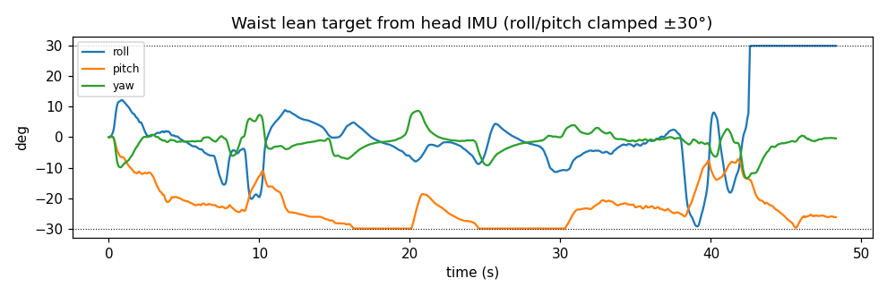
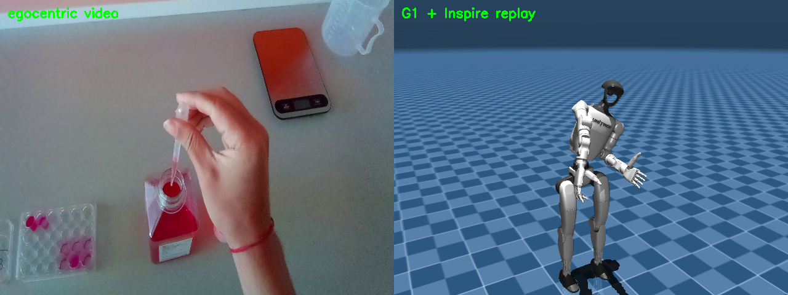
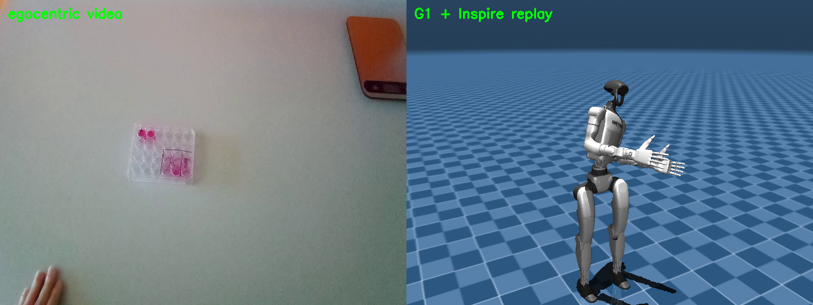

# Dimenso Hackathon Report — egocentric lab demo → Unitree G1 + Inspire in simulation

Recover human **hand and arm** motion from smart-glasses head-cam RGB + head IMU,
retarget it onto a Unitree **G1 with five-finger Inspire hands**, and replay it in
MuJoCo. **Motion translation only** — human demo in, robot joint trajectory out,
replayed in sim. No object interaction or manipulation planning.

> **Note on numbers.** Coverage, timing, and dataset figures below are *measured*
> from the diagnostics pass and the offline run. Quantitative motion-fidelity
> figures (reach/tracking error, rollout success) depend on an IK-tuning pass that
> is still to come and are marked **`TODO (post-IK-tuning)`** rather than guessed.

---

## 1. Problem framing & assumptions

We chose **task_04 (Pasteur-pipette)** from the four recorded lab tasks. The choice
is grounded in the diagnostics hand-detection sweep (`docs/diagnostics.md`): task_04
had a hand visible in **77.0%** of sampled frames versus 34–49% for the others,
the **highest** detection confidence (0.976 vs ~0.95), and the **shortest** no-hand
dropout (~3.4 s vs 5.3–6.1 s). Since hand *presence in frame* — not detector
quality — is the binding constraint, task_04 is the most tractable demonstration.

The core reframe of the project: **a forward-facing egocentric camera recovers hands
and forearms, not the full body.** The diagnostics Pose sanity check is blunt about
this — only **29% of frames return any MediaPipe Pose result**, and when one fires
the lower body is unreliable (knee visibility 0.46, ankle 0.22; the high shoulder/hip
"visibility" is the model hallucinating an unseen torso). We therefore do **not**
attempt whole-body capture. Instead we translate hand+arm motion onto the G1's
**upper body**, **freeze the legs** at the stand keyframe, and drive the **torso/waist
from the head IMU** (the G1 has no neck joint, so head orientation maps to the 3
waist joints only).

Hand assumption: the demonstrator's dexterous motion is mapped onto a **five-finger
Inspire DFQ hand grafted onto the menagerie G1** — a single MuJoCo model with
**53 actuated DoF** (29 G1 + 24 finger joints), documented in
`docs/inspire_hand_model.md`. The robot works over a white table whose top sits at
the same height the pipeline maps wrists onto (0.75 m):

## 2. Data pipeline (the centerpiece)

`data_pipeline/run_offline.py` chains five stages; all joint/actuator names are read
from the MuJoCo model at run time, nothing hardcoded.

**Perception.** The video is decoded with real per-frame timestamps; **MediaPipe
Hands** runs per frame for 21 landmarks/hand with handedness and confidence.
Landmark coordinates are de-jittered by a **One Euro filter** (Casiez et al., 2012),
and detections below a confidence gate are dropped. We derive a per-finger **curl**
descriptor (path-length ratio) and a thumb-index **pinch** distance. Handedness is
flipped for the non-mirrored egocentric view.

**Head IMU → waist lean.** Diagnostics showed the IMU is ~100 Hz but with jittery
per-sample dt (1–18 ms), so we **resample the IMU onto the video frame timestamps**
rather than assume a fixed 10 ms grid. Head orientation comes from a complementary
filter — gravity-from-accelerometer for roll/pitch, gyro integration for change,
expressed **relative to the recording's first frame** — and is clamped to **±30°**
before driving the waist.

**2D → 3D wrist target (approximated).** With RGB only and no depth, the 3D wrist
target is **approximated**: the wrist's image position maps onto a horizontal table
plane in front of the robot, and apparent hand scale (+ MediaPipe's weak relative z)
acts as a height/depth proxy. We say this plainly — it is a monotonic guess, not a
calibrated reconstruction, and it is the largest single source of error.

**Output.** `outputs/task04_dataset.npz` + a `task04_dataset.schema.json` sidecar
document every array: per-frame timestamp, per-hand approximate 3D wrist target,
per-finger curl/pinch, waist-lean target, per-arm hand-present flag, and the full
G1+Inspire **`qpos` trajectory** ready for replay. (Outputs are gitignored; the
schema documentation is the committed record of the format.)

## 3. Method (perception → retargeting → imitation learning → simulation)

**Retargeting.** `method/retarget.py` solves **damped-least-squares IK** using MuJoCo
body Jacobians so each detected wrist reaches its 3D target. The **3 waist joints are
included as shared IK DoF**, softly biased toward the IMU lean target, so the torso
leans to assist long reaches rather than fighting them; both arms are solved jointly
because they share the waist. Finger curl maps to the Inspire finger joints; when a
hand isn't visible that arm **stows** (upper arm down, forearm forward ~90°, fingers
open) after a brief hold-last-valid window; all joint targets are **velocity-clamped**
so motion eases, especially on stow transitions.

**Imitation learning (a credible plan, not run).** Honestly: **this dataset alone
cannot train a task policy.** It has no depth, no object/scene state, no reward, and
is open-loop — it is a *demonstration* signal, not a closed-loop training environment.
As demonstration data, though, it is a legitimate input to imitation learning. A
credible path: (a) collect many more demos with **added object perception** — a
depth sensor or a wrist-mounted RGB-D camera — so the policy can see what it
manipulates; (b) convert episodes to a standard format (**LeRobot v2**) with
synchronized proprioception + vision + action; (c) train a **behavior-cloning** or
**diffusion-policy** baseline with **inputs** = proprioception (G1+Inspire joint
state) + vision (ego + wrist views) and **outputs** = joint / end-effector targets;
(d) **validate** on held-out demonstrations and by **sim rollout success rate** on
the task. A tiny overfit-one-demo sanity run was **out of scope** in the available
time. Expected baseline numbers are **`TODO (post-IK-tuning + data collection)`**.

**Simulation.** The combined G1+Inspire model loads in MuJoCo with legs frozen at the
stand keyframe; the retargeted trajectory is replayed both as an offscreen mp4 and in
a **live native viewer** (`sim/replay_g1.py`, `--live`), which plays the precomputed
trajectory in real time.

## 4. Validation

On the task_04 recording (1431 frames @ 29.6 fps):

- **Hand-detection coverage / stow:** **79.6% of frames use real tracking, 20.4% fall
  back to stow** (right hand 76.5%, left 26.5%). The asymmetry means bimanual moments
  often render one-handed — an honest limitation, not a bug.
- **IMU↔video timing:** durations 48.42 s (IMU) vs 48.30 s (video) — ~0.12 s slack,
  consistent with the documented "no shared clock" sync assumption.
- **Qualitative motion:** the frame-aligned side-by-side (source video ∥ replay)
  shows the right-arm reach **direction** tracking the demo, with absolute reach
  **depth** visibly approximate (expected, RGB-only).

Side-by-side (egocentric source ∥ G1+Inspire replay):

**Quantitative tracking accuracy** (achieved end-effector vs target wrist position,
and any rollout success metric) is **`TODO (post-IK-tuning)`** — it will move once the
IK weights/rate-limits are tuned, so we don't report a misleading figure now.

## 5. Feasibility & cost proposal

*(Proposal estimates with stated assumptions, not measured results.)*

**BOM (research MVP).** Egocentric capture with depth — either depth-capable smart
glasses (research units ~$2–3k) or cheaper standard glasses + a wrist-mounted RGB-D
camera (e.g. RealSense-class, ~$250–400); one **Unitree G1** (~$16k entry class);
**two Inspire five-finger hands** (RH56-class, ~$3–5k each); one training workstation
(a single RTX-4090-class GPU, ~$1.6k, or cloud A100 at ~$1.5–3/hr). Total hardware on
the order of **$25–35k** for a single-cell prototype, dominated by the robot.

**Data + compute.** A behavior-cloning baseline for one constrained task typically
needs on the order of **50–200 demonstrations**; at ~1 min/demo that's **~1–4 hours**
of capture per task, more for a diffusion policy. Training a small BC/diffusion
baseline is **a few GPU-hours to ~1 GPU-day** on a single modern GPU — cheap relative
to data collection, which is the real cost driver.

**Prototype → MVP timeline.** Phase 0 (done): offline translation engine + sim replay.
Phase 1 (~1–2 wks): add a depth/wrist-camera so object state is observable. Phase 2
(~1 wk): scale demo collection + LeRobot conversion. Phase 3 (~1 wk): train + sim-eval
a BC baseline. Phase 4 (later): sim-to-real on hardware. **Tradeoff:** the cheap path
(RGB-only, this engine) gets you motion translation fast but caps at open-loop replay;
spending on depth + data is what unlocks a closed-loop policy. **Risks:** the
sim-to-real gap on a dexterous hand, occlusion of the manipulated object in egocentric
views, and the sheer data scale real manipulation policies demand.

## 6. Limitations & next steps

We are direct about what this does not do:

- **Egocentric depth is approximated** — there is no depth sensor, so the 3D wrist
  target is a scale/plane heuristic; reach direction is right, absolute depth is a guess.
- **IMU yaw drifts** (no magnetometer; we leak it toward zero) and there is **no shared
  IMU↔video clock**, so the start offset is a best-effort assumption (~2–3 frames).
- **Left-hand coverage is low (26.5%)**, so bimanual moments render one-handed.
- **Full-body pose is unrecoverable** from the forward cam (the project's founding
  observation), hence legs frozen + IMU-driven torso.
- **Inspire underactuation is modeled as independent joints** — the real hand drives
  ~12 joints from ~6 motors; we drive all 12 independently, a deliberate simplification
  documented in `docs/inspire_hand_model.md`.
- **The real-time live web panel was designed but not built** in the time. The concrete
  threaded architecture (native MuJoCo viewer + solver thread + uvicorn + MJPEG of the
  annotated video, with frame-dropping to stay on the clock) is written up in
  `docs/live_architecture.md` — verdict there: live is feasible, biggest risk is GIL/CPU
  contention.

**Next steps:** tune the DLS IK weights and rate limits (the pending pass), add a depth
or wrist-cam prior to fix reach depth, detect a shared motion event to pin the
IMU/video offset, then build the live panel per the architecture doc.

## 7. References

- **MediaPipe Hands** — Zhang et al., "MediaPipe Hands: On-device Real-time Hand
  Tracking", 2020 (Google).
- **One Euro filter** — Casiez, Roussel, Vogel, "1€ Filter: A Simple Speed-based
  Low-pass Filter for Noisy Input in Interactive Systems", CHI 2012,
  https://gery.casiez.net/1euro/
- **MuJoCo Menagerie / Unitree G1** — Google DeepMind, `mujoco_menagerie/unitree_g1`.
- **Inspire hand description** — `unitreerobotics/unitree_ros`,
  `robots/g1_description/inspire_hand` (DFQ).
- **Damped-least-squares IK** — Buss & Kim, "Selectively Damped Least Squares for
  Inverse Kinematics", 2005; Nakamura & Hanafusa, singularity-robust inverse, 1986.
- **Egocentric full-body limitation** — context for body-from-head-cam difficulty,
  e.g. Tome et al., "xR-EgoPose", ICCV 2019 (egocentric pose is occluded/hard).
- **Imitation-learning targets** — LeRobot (Hugging Face) dataset format; diffusion
  policy (Chi et al., 2023); dexterous retargeting (AnyTeleop, Qin et al., 2023).
- Project docs: `docs/diagnostics.md`, `docs/inspire_hand_model.md`,
  `docs/live_architecture.md`.
