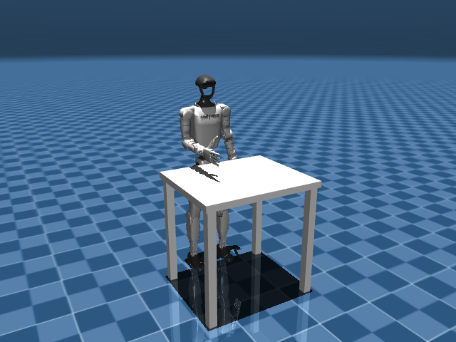
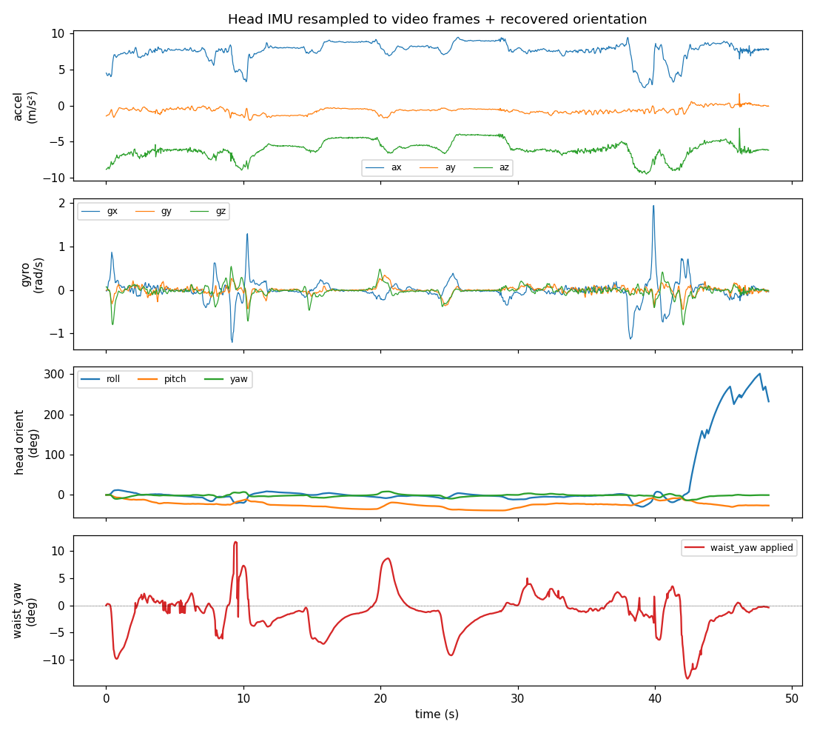
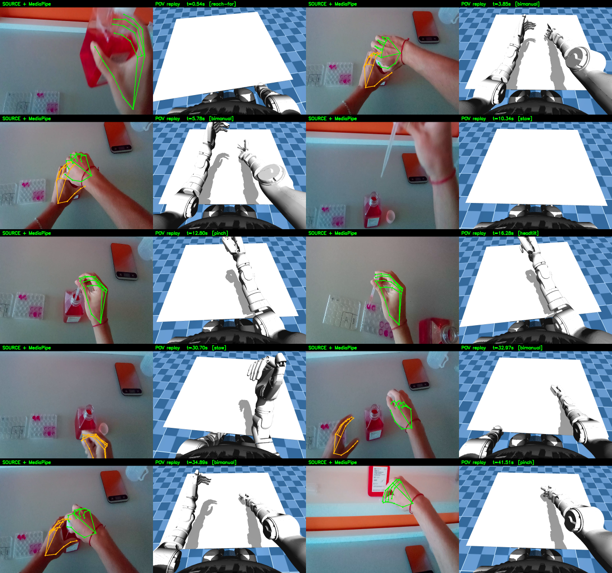
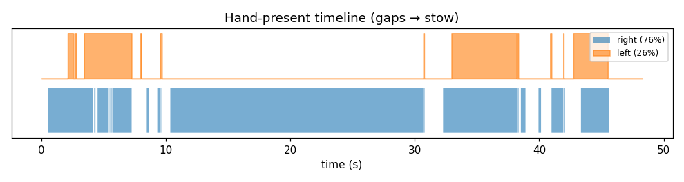
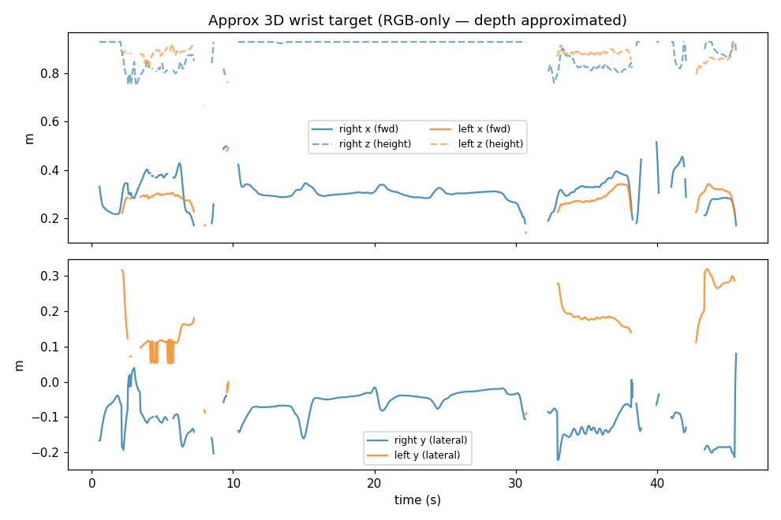

# Dimenso Hackathon Report — egocentric lab demo → Unitree G1 + Inspire in simulation

Recover human **hand and arm** motion from smart-glasses head-cam RGB + head IMU,
retarget it onto a Unitree **G1 with five-finger Inspire hands**, and replay it in
MuJoCo. **Motion translation only** — human demo in, robot joint trajectory out,
replayed in sim. No object interaction or manipulation planning. All numbers below
are measured from the final, IK-tuned pipeline on `task_04_pasteur_pipette`.

---

## 1. Problem framing & assumptions

We chose **task_04 (Pasteur-pipette)** from the four recorded lab tasks. The choice
is grounded in the diagnostics hand-detection sweep (`docs/diagnostics.md`): task_04
had a hand visible in **77.0%** of sampled frames versus 34–49% for the others,
the **highest** detection confidence (0.976 vs ~0.95), and the **shortest** no-hand
dropout (~3.4 s). Since hand *presence in frame* — not detector quality — is the
binding constraint, task_04 is the most tractable demonstration.

The core reframe: **a forward-facing egocentric camera recovers hands and forearms,
not the full body.** The diagnostics Pose check is blunt — only **29% of frames
return any MediaPipe Pose result**, and when one fires the lower body is unreliable
(knee visibility 0.46, ankle 0.22; the high shoulder/hip "visibility" is the model
hallucinating an unseen torso). So we do **not** attempt whole-body capture: we
translate hand+arm motion onto the G1's **upper body**, **freeze the legs** at the
stand keyframe, and drive the **torso from the head IMU** (the G1 has no neck joint;
after tuning the torso stays upright and only **turns** — see §3/§4).

The dexterous motion maps onto a **five-finger Inspire DFQ hand grafted onto the
menagerie G1** — one MuJoCo model, **53 actuated DoF** (29 G1 + 24 finger joints),
documented in `docs/inspire_hand_model.md`. The robot works over a white table whose
top sits at the height the pipeline maps wrists onto (0.75 m):

## 2. Data pipeline (the centerpiece)

`data_pipeline/run_offline.py` chains five stages; all joint/actuator names are read
from the MuJoCo model at run time, nothing hardcoded.

**Perception.** Video decoded with real per-frame timestamps; **MediaPipe Hands** per
frame → 21 landmarks/hand + handedness + confidence. Landmarks are de-jittered by a
**One Euro filter** (Casiez et al., 2012) and confidence-gated. We derive per-finger
**curl** (path-length ratio), the thumb-index **pinch**, and **thumb-tip↔fingertip
distances** (the descriptor the tuned thumb retarget uses). Handedness is flipped for
the non-mirrored egocentric view.

**Head IMU → waist.** The IMU is ~100 Hz but jittery (per-sample dt 1–18 ms), so we
**resample it onto the video frame timestamps** (not a fixed 10 ms grid). A
complementary filter recovers head orientation (accel-gravity roll/pitch + gyro
integration, yaw leaked), expressed relative to frame 0. The tuned retargeter uses
**only the head yaw** to *turn* the waist and keeps the torso upright (§3).

**2D → 3D wrist target (approximated).** RGB-only, no depth, so the target is
**approximated**: image position → table-plane X, hand scale (+ MediaPipe z) → depth
proxy, and the **lateral Y now tracks the real detected wrist separation**. This is a
monotonic guess, not a calibrated reconstruction — the largest single source of error.

**Output — the dataset.** `outputs/task04_dataset.npz` + a committed
`task04_dataset.schema.json` document **every** per-frame field, time-aligned to the
video frames: frame index/timestamp; the **raw MediaPipe landmark layer** (both hands,
21×3); handedness/confidence/present + stow flags; curl + thumb-distances; the
**resampled IMU** (accel, gyro) + recovered head orientation (roll/pitch/yaw) + the
**waist-yaw actually applied**; approximate 3D wrist targets; and the **full 53-joint
G1+Inspire trajectory** with every joint column named (`joint_targets` +
`actuated_joint_names`, plus full `qpos`). The `.npz` is gitignored; the schema is the
committed contract. An IMU visualization (`report/figures/imu_visualization.png`) and
sanity plots are produced by `notebooks/01_explore.ipynb`.

## 3. Method (perception → retargeting → imitation learning → simulation)

**Retargeting.** `method/retarget.py` solves **damped-least-squares IK** (MuJoCo body
Jacobians) so each detected wrist reaches its 3D target, both arms jointly. After
tuning: the **torso stays upright** — `waist_roll`/`waist_pitch` are locked to 0 and
**only `waist_yaw`** is driven (softly, by head yaw), so the robot *turns* toward where
the person looked but never leans. Fingers use **distance-based retargeting**: the
human thumb↔fingertip distance maps to a closeness that flexes both that finger and the
**thumb** (so the thumb actually flexes into pinches), with curl as a fallback. When a
hand isn't seen, that arm **stows hanging straight down** (out of the egocentric frame)
after a hold-last-valid window; all targets are **velocity-clamped** for smooth eases.

**Imitation learning — a sketch (honestly, not built).** This is the one pillar we did
not implement, so we reason about it concretely rather than hand-wave.

*Framing.* The dataset is **demonstration data** — per-frame **state→action pairs**:
observations (proprioception + vision) paired with the commanded joint targets. It is
**not** a closed-loop training environment: there is **no depth, no object/scene state,
no reward, and it is open-loop** (the robot never acts back on the world). So it can
seed imitation learning but cannot, alone, train a *task* policy. We state that plainly.

*Candidate models (inputs→outputs, why):*
- **Behavior cloning (BC) MLP/CNN baseline** — obs→next joint targets, supervised. Why:
  simplest baseline to validate the data pipeline and get a first success-rate number.
- **Diffusion Policy** (Chi et al., 2023) — obs→a *distribution* over short action
  chunks. Why: handles multimodal, contact-rich manipulation far better than a unimodal
  BC regressor; strong dexterous-manipulation baseline.
- **ACT / Action-Chunking Transformer** (ALOHA, Zhao et al., 2023) — obs→chunk of future
  actions via a CVAE transformer. Why: built for fine bimanual teleop demonstrations,
  exactly our regime (two arms + dexterous hands).
- **VLA (OpenVLA / π-0 class)** — image + language→action. Why: language-conditioned
  generalization across tasks/objects once we have many demos; the path to "tell the
  robot what to do," not just replay one motion.

*Inputs / outputs, concretely.* **Inputs:** proprioception (the 53 G1+Inspire joint
states) + vision (the egocentric frame + a proposed **wrist camera** for object state)
+ optional language. **Outputs:** joint-target (or end-effector-target) sequences —
exactly what our dataset already stores per frame.

*Data gathering / scaling.* Collect **many more demos** (order **50–200 per task** for a
BC baseline; more for diffusion), **add a depth or wrist-mounted RGB-D camera** so the
policy can see the manipulated object, use **multiple operators** for diversity,
**auto-segment** object-interaction phases, and **convert to LeRobot v2**. Our pipeline
already emits LeRobot-friendly per-frame state-action records (named joints + vision +
timestamps), so conversion is a formatting step, not a redesign.

*Validation plan.* (1) **held-out demo tracking error** (does the policy reproduce
unseen demos?), then (2) **sim rollout success rate** on the task, then (3)
**sim-to-real** on hardware. A tiny overfit-one-demo sanity run was **out of scope** in
the available time — an honest gap, not a hidden one.

**Simulation.** The combined model loads in MuJoCo with legs frozen at stand; the
retargeted trajectory replays as an offscreen mp4 and in a **live native viewer**
(`sim/replay_g1.py --live`) at real time.

## 4. Validation

On task_04 (1431 frames @ 29.6 fps). The tuning pass is reflected here:

- **Tracking vs stow:** **79.6% of frames use real tracking, 20.4% stow** (right hand
  76.5%, left 26.5%). Stow now **hangs the arm straight down, out of the POV frame**, so
  a lost hand reads as idle rather than miming an action.
- **Torso upright (tuned):** `waist_roll` and `waist_pitch` are **0.0° on every frame**
  (was −20…−30° before, a distracting lean); only `waist_yaw` turns, staying within
  ±~12°. This also fixed a latent axis-mismap (lean `[roll,pitch,yaw]` had been paired
  against joints `[yaw,roll,pitch]`).
- **Hand separation now tracks the human (tuned):** robot hand-sep went from ~flat
  (≈0.29–0.45 m, fixed by a `SIDE_BIAS`) to **monotonic with the human** — human
  0.326 / 0.375 / 0.384 / 0.555 → robot 0.233 / 0.237 / 0.338 / 0.428.
- **Thumb now flexes into pinches (tuned):** at the pinch frame the thumb went from
  static (proximal-pitch −0.09, intermediate 0.01, distal 0.01 rad) to **fully flexed
  (≈0.60 / 0.80 / 1.20 rad)** with the index at 1.70 — previously it only opposed.
- **IMU↔video timing:** durations 48.42 s vs 48.30 s (~0.12 s slack), consistent with
  the documented no-shared-clock assumption.
- **Continuous clip:** a **250-frame side-by-side** (`outputs/tuned_compare_250.mp4`,
  frames **307–556**, **100% right-hand coverage**) plays the source ∥ POV replay
  frame-aligned; the live viewer plays the same trajectory in real time.

Tuned side-by-side contact sheet (source + MediaPipe ∥ G1+Inspire from the head POV):

## 5. Feasibility & cost proposal

*(Proposal estimates with stated assumptions, not measured results.)*

**BOM (research MVP).** Egocentric capture with depth — depth-capable smart glasses
(~$2–3k) or standard glasses + a wrist-mounted RGB-D camera (RealSense-class, ~$250–400);
one **Unitree G1** (~$16k entry class); **two Inspire five-finger hands** (RH56-class,
~$3–5k each); one training workstation (RTX-4090-class GPU ~$1.6k, or cloud A100 at
~$1.5–3/hr). Hardware on the order of **$25–35k** for a single cell, dominated by the
robot.

**Data + compute.** A BC baseline for one constrained task needs ~**50–200
demonstrations** (~1–4 h capture at ~1 min/demo); diffusion wants more. Training a small
BC/diffusion baseline is **a few GPU-hours to ~1 GPU-day** — cheap next to data
collection, which is the real cost driver.

**Prototype → MVP timeline.** P0 (done): offline engine + sim replay. P1 (~1–2 wks): add
depth/wrist-cam for object state. P2 (~1 wk): scale demos + LeRobot conversion. P3
(~1 wk): train + sim-eval a BC baseline. P4 (later): sim-to-real. **Tradeoff:** the
RGB-only path is fast but caps at open-loop replay; depth + data is what unlocks a
closed-loop policy. **Risks:** sim-to-real gap on a dexterous hand, object occlusion in
egocentric views, and the data scale manipulation policies demand.

## 6. Limitations & next steps

Direct about what this does not do:

- **Egocentric depth is approximated** (no depth sensor): reach *direction* is right,
  absolute forward depth is a guess — still the biggest error source.
- **Left-hand coverage is low (26.5%)**, so bimanual moments still render one-handed.
- **Thumb-distance retarget is only reliable when the hand is fully in frame**; partial
  views fall back to curl.
- **No shared IMU↔video clock** → start offset is a best-effort assumption (~2–3 frames);
  IMU yaw is drift-leaked (no magnetometer).
- **Full-body pose is unrecoverable** from the forward cam (the founding observation),
  hence legs frozen + IMU-driven torso turn.
- **Inspire underactuation modeled as independent joints** (real hand ≈6 motors / 12
  joints) — a deliberate simplification (`docs/inspire_hand_model.md`).
- **The real-time live web panel was designed but not built.** The concrete threaded
  architecture (native MuJoCo viewer + solver thread + uvicorn + MJPEG of the annotated
  video, frame-dropping to stay on the clock) is in `docs/live_architecture.md` —
  verdict: feasible, biggest risk is Python GIL/CPU contention.

**Next steps:** add a depth / wrist-cam prior to fix reach depth; improve left-hand
re-acquisition; detect a shared motion event to pin the IMU/video offset; collect demos
and train the BC/diffusion baseline (§3); build the live panel per the architecture doc.

## 7. References

- **MediaPipe Hands** — Zhang et al., 2020 (Google).
- **One Euro filter** — Casiez, Roussel, Vogel, CHI 2012, https://gery.casiez.net/1euro/
- **MuJoCo Menagerie / Unitree G1** — Google DeepMind, `mujoco_menagerie/unitree_g1`.
- **Inspire hand description** — `unitreerobotics/unitree_ros`, `g1_description/inspire_hand` (DFQ).
- **Damped-least-squares IK** — Buss & Kim 2005; Nakamura & Hanafusa 1986.
- **Imitation learning** — Diffusion Policy (Chi et al., 2023); ACT/ALOHA (Zhao et al.,
  2023); OpenVLA (Kim et al., 2024) / π-0 (Physical Intelligence, 2024); LeRobot
  (Hugging Face) dataset format; AnyTeleop dexterous retargeting (Qin et al., 2023).
- **Egocentric full-body limitation** — e.g. Tome et al., "xR-EgoPose", ICCV 2019.
- Project docs: `docs/diagnostics.md`, `docs/inspire_hand_model.md`, `docs/live_architecture.md`.
